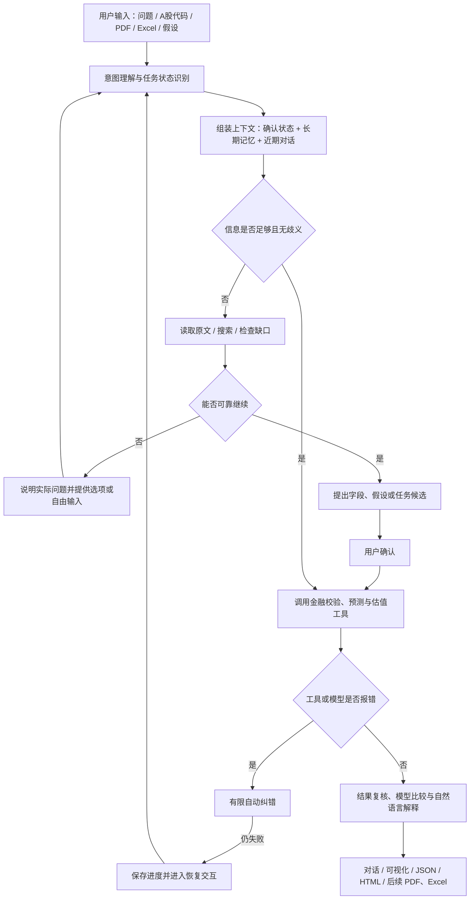

# ValuationAgent：Agent 工作机制与完整流程

## 1. Agent 的定位

ValuationAgent 面向 A 股上市公司估值研究。它以大语言模型（LLM）作为任务的理解、规划和解释核心，以经过注册的程序工具作为数据读取、规则校验、金融计算和文件导出的执行核心，以用户确认为高影响决策的最终控制点。

这不是一个让 LLM 直接“心算估值”的聊天机器人。系统采用以下分工：

- **LLM**：理解用户意图、结合上下文规划步骤、选择工具、处理非结构化材料、发现歧义、提出候选方案、解释结果。
- **程序工具与金融模型**：执行文件解析、搜索、数据标准化、勾稽检查、预测、DCF、相对估值、敏感性分析和导出。正式数字必须由工具产生。
- **用户**：确认研究范围、候选事实、重要假设和歧义处理方式，可以选择系统方案，也可以直接输入修改要求。
- **存储与审计层**：保存会话状态、资料哈希、原文位置、候选状态、工具输入输出、异常恢复和版本信息。

因此，LLM 是全流程的“思考与编排引擎”，确定性工具是“计算与校验引擎”，二者各自负责适合的工作。

## 2. 一句话流程

> 用户用自然语言、A 股代码或文件说明任务 → Agent 理解意图并组装上下文 → 按需调用资料、搜索、校验和金融工具 → 发现问题时向用户澄清 → 用户确认后执行确定性模型 → 交叉验证和解释 → 输出带来源与执行记录的结果。

## 3. 输入

### 3.1 用户可以提供什么

| 输入类型 | 示例 | Agent 的处理方式 |
| --- | --- | --- |
| 自然语言目标 | “研究 600519，并用 DCF 与相对估值交叉验证” | 识别公司、目标、方法和仍需确认的设置 |
| A 股代码或公司名 | `600519.SH`、贵州茅台 | 形成研究对象候选；在线取数接入后调用数据工具 |
| 历史财务资料 | 年报 PDF、财务 Excel、CSV、JSON | 解析为可定位原文块，再由 LLM按需读取和映射 |
| 预测与假设资料 | 预算表、行业预测、Beta 或增长率说明 | 与历史事实分开，保存来源、期间和适用口径 |
| 可比公司资料 | 同业名单、倍数表 | 检查期间、口径、样本数量和纳入理由 |
| 政策与其他证据 | 政策文件、监管资料、经营说明 | 区分原文事实、适用范围、影响推断和待核实部分 |
| 对话中的更正 | “这里应当是 2024 年合并口径” | 作为用户来源形成新候选，保留旧记录并再次确认 |
| 选项或自由文字 | 选择一个建议，或输入自定义处理方式 | 解除当前阻塞，然后从已保存状态继续 |

### 3.2 输入不需要一开始就完整

用户不必先整理成严格模板。Agent 可以从不完整目标和杂乱资料开始：先识别已知内容，再列出缺口，并只询问当前最影响后续步骤的问题。

读取文件不等于自动信任文件。字段、年份、单位、币种、报告期或合并口径存在冲突时，系统保留原样并请求核对，不会用看似合理的默认值覆盖问题。

## 4. 处理过程

### 4.1 创建或恢复任务

CLI 和 Web 共用同一个 `ResearchService`、SQLite 会话和事件记录。恢复任务时会加载：

- 已确认的研究对象、估值日和方法；
- 已上传资料及 SHA-256；
- 候选、已确认和已拒绝字段；
- 当前资料缺口和待确认问题；
- 长期上下文记忆；
- 最近异常和完整执行事件。

API Key 不进入 SQLite，也不写入导出文件；对话或工具参数中误贴入的常见凭证格式也会在持久化前替换为脱敏标记。程序重启后可以恢复任务内容，实时 LLM 连接需要重新建立。

### 4.2 理解用户意图

每个回合先执行一层保守、可解释的意图识别，例如：

- 新建或调整估值研究；
- 提供材料；
- 解释结果或假设；
- 修改假设；
- 比较版本；
- 分析政策；
- 导出结果；
- 恢复复核。

这个分类只是给 LLM 的计划提示，不会直接修改任务，更不会授权计算。如果分类与用户原话冲突，LLM 必须以用户原话和已确认状态为准；仍不确定时发起澄清。

### 4.3 四层上下文

长对话采用四层上下文，而不是无限回放全部消息：

1. **权威任务状态**：研究范围、资料、事实状态、缺口和当前问题。
2. **长期记忆**：用户明确表达的目标、偏好、约束、决定和术语定义。
3. **近期对话窗口**：保留最近回合，用于理解当前指代和连续语义。
4. **按需证据读取**：年报和表格不整份塞入提示词；Agent 根据任务调用 `read_document` 读取相关原文块。

长期记忆具有稳定 `key`，同一事项变化时覆盖原键，并记录来源消息 ID。它不保存：

- 财务数值和正式假设；
- 未确认的模型推断；
- 临时工具结果；
- API Key、口令或疑似秘密。

财务数字进入独立的候选事实流程，因此长期对话不会把模型曾经说过的数字误当成已确认输入。Web 的“上下文”页签和 CLI 的 `/memory` 可以查看当前长期记忆。

### 4.4 LLM 工具循环

LLM 每一步必须调用一个已注册工具。自由文本不能直接修改正式状态或产生正式估值。当前基础工具包括：

- `inspect_context`：查看当前研究状态；
- `read_document`：按关键词和分页读取原文；
- `propose_task`：提出研究范围候选；
- `propose_facts`：提出带原文的字段候选；
- `search_sources`：调用配置的搜索 provider，未配置时如实返回；
- `update_data_gaps`：更新尚未解决的资料问题；
- `update_memory`：在继续调用其他工具前保存明确的长期上下文；
- `check_preparation`：检查进入金融模型前的准备情况；
- `finish_response`：综合解释、提出澄清并维护长期记忆。

未来金融工具通过 `AgentToolProvider.tool_specs()` 接入同一个白名单循环。Provider 返回带 Pydantic 参数模型的 `ToolSpec`，无需改写 CLI、Web 或 Agent 主循环。每次扩展工具调用仍经过统一的事件、错误和审计包装。

### 4.5 非结构化资料处理

Agent 先读取标题、表头、单位、相邻行和注释，再判断字段与年份。候选数值必须满足：

- 数值真实出现在连续原文中；
- 保存原始字段、原始值、单位、期间和报表口径；
- 关联 `block_id` 和原文 `quote`；
- 单位换算由程序完成并保留原值；
- 单位、期间或口径未知时产生警告；
- 同字段同期间出现冲突时不能批量确认。

字段名称变化、年份缺失或倒序、多级表头、单位变化、公式未求值等情况不能静默修正。Agent 会说明实际发现、资料位置、不确定点和影响，然后给出处理选项或请用户自由输入。

### 4.6 人工确认

以下事项进入确认界面：

- 公司、估值日和估值方法；
- 从文档或用户消息提取的事实；
- 多种合理字段/年份映射；
- 搜索不可用时的替代方案；
- 无法自动恢复的模型、工具或文件错误；
- 后续将接入的重要预测假设和金融调整。

确认具有问题 ID。过期选项不能提交；自由文字会标记为对当前问题的补充或修改，不会被误当成接受旧候选。

### 4.7 金融模型接入后的工作方式

金融模型完整接入后，LLM 将参与全流程编排：

1. 判断所需历史数据和模型适用性；
2. 调用取数、搜索或文档工具补齐候选来源；
3. 调用数据标准化和财务勾稽工具；
4. 对异常提出处理建议，并等待用户确认关键项；
5. 调用收入预测、WACC、DCF、相对估值和敏感性工具；
6. 比较模型区间，定位分歧来源；
7. 结合工具产生的数字和来源生成自然语言解释；
8. 调用报告工具生成 Excel、PDF、JSON 等成果。

LLM 选择和解释工具，金融工具执行公式。即使 LLM 出现幻觉，也不能绕过参数 schema、财务规则和结果校验直接写入正式结果。

## 5. 容错与兜底

### 5.1 处理原则

系统采用“有限自动恢复，然后转用户”的策略：

- 工具参数不合法：向 LLM 返回不包含敏感输入的字段错误，允许修正；
- 工具前置条件不满足：返回真实原因，允许换工具或补资料；
- 同一失败调用重复两次：停止循环，避免无效重试；
- 模型未按协议调用工具：给出协议反馈，超过步数后停止；
- 模型接口超时或限流：供应商层有限重试，仍失败则进入恢复交互；
- 文件无法读取：保留此前成功文件，记录失败文件并给出恢复选项；
- 数据存在歧义：不猜测，继续处理无歧义部分，并只询问最小阻塞问题；
- 金融规则失败：未来由金融工具返回明确规则、差额和影响，禁止用 LLM 文本覆盖硬错误。

### 5.2 恢复交互

无法可靠继续时，会话生成结构化 `ResearchIssue`，包括问题代码、阶段、面向用户的说明、是否可重试和相关文件 ID。界面提供与问题匹配的选项：

- 按现有资料重试；
- 补充或修改要求；
- 保留进度并跳过；
- 模型认证失效时重新配置模型；
- 明确切换到离线资料整理。

用户也可以直接输入自己的处理方式。重试使用原请求和已保存状态，不要求用户重复描述，也不会重复确认已经采纳的数据。

系统不会把异常悄悄替换为演示数据，不会把搜索失败替换为 LLM 记忆，也不会在错误后生成一个看似完整的估值结果。

## 6. 可溯源与可信设计

### 6.1 来源链

每份上传资料记录：

- 原始文件名和用途；
- 文件字节数；
- SHA-256；
- 解析警告；
- 可定位的原文块 ID；
- PDF 页码、Excel 工作表与行号等位置。

每个候选事实记录原始值、标准化值、单位、期间、口径、原文、来源块、状态和警告。用户更正产生新候选，旧记录保留为被替代或拒绝状态。

### 6.2 执行链

每轮 LLM 执行保存以下非秘密元数据：

- Agent 协议版本和 Prompt 版本；
- 模型供应商与模型名；
- 上下文 SHA-256；
- 已注册工具清单及扩展 Provider 版本；
- 工具开始、完成、失败、耗时和输入输出；
- 意图分类、确认、异常恢复和记忆更新事件。

内部思考过程不会保存到消息、事件或报告。可信度来自可核验的来源、工具结果、版本和规则，不来自展示一段不可验证的“思维链”。

### 6.3 状态隔离

系统明确区分：

- 原始资料；
- 候选事实；
- 已确认事实；
- 用户假设；
- 程序计算结果；
- LLM 推断和解释；
- 资料缺口与异常。

这些状态不会因为自然语言表达相似而自动互换。

## 7. 输出

### 7.1 当前研究阶段输出

- 持续对话和澄清选项；
- 研究范围；
- 资料清单和文件哈希；
- 候选、已确认和已拒绝字段；
- 缺口、警告和最近异常；
- 长期上下文；
- 工具与 Agent 执行记录；
- JSON 复核包；
- 可打印 HTML 研究报告。

### 7.2 金融模型接入后的输出

- DCF 估值结果与区间；
- 相对估值结果与区间；
- 悲观、基准、乐观情景；
- WACC × 永续增长率等敏感性分析；
- 两类模型的重叠、分歧和原因诊断；
- 假设依据、资料说明和风险提示；
- 可复算 JSON、Excel 模型和 PDF 报告。

所有正式输出应绑定任务版本、估值日、输入哈希、金融插件版本和来源清单。

## 8. 一个典型回合

用户上传一份 Excel，并说：“提取近十年营业收入。”

1. Agent 读取工作表标题、表头、单位和相关数据行。
2. 发现前五列使用“年度”，后五列使用“报告期”，其中一列年份重复。
3. Agent 继续提取没有歧义的年份，但不移动重复列数值。
4. Agent 告知重复年份所在工作表和行号、当前不能判断的原因以及对 CAGR 的影响。
5. 界面给出“按表头原样保留”“暂不采用该列”“由用户指定年份”等方案，同时允许自由输入。
6. 用户选择后，Agent 按原文提出候选字段。
7. 用户确认候选后，字段才能进入后续金融工具。
8. 全过程保留文件哈希、原文块、选择和工具事件。

## 9. 主要代码位置

| 模块 | 文件 | 作用 |
| --- | --- | --- |
| Agent 系统规则与上下文 | `src/valuationagent/llm/context.py` | Prompt、上下文快照、长期与近期信息裁剪 |
| 有限工具循环 | `src/valuationagent/llm/agent.py` | 单工具协议、自我纠错、无进展停止 |
| 模型适配 | `src/valuationagent/llm/client.py` | OpenAI Compatible、DeepSeek 差异、重试和脱敏错误 |
| 意图识别 | `src/valuationagent/llm/intent.py` | 可解释的基础分类与槽位提取 |
| 研究 Agent 服务 | `src/valuationagent/application/research.py` | 工具注册、确认、记忆、恢复、审计和统一会话 |
| 会话契约 | `src/valuationagent/schemas/research.py` | 任务、候选、问题、记忆和异常结构 |
| Agent 通用契约 | `src/valuationagent/schemas/agent.py` | 意图、上下文、证据、搜索和产物结构 |
| 工具扩展协议 | `src/valuationagent/core/plugins.py` | `AgentToolProvider` 与金融插件协议 |
| 搜索适配 | `src/valuationagent/search/providers.py` | 搜索 Provider 协议、未配置与模拟实现 |
| 本地持久化 | `src/valuationagent/storage/sqlite.py` | 会话、消息、事件、资料、版本和检查点 |
| 研究导出 | `src/valuationagent/application/research_export.py` | JSON 与 HTML 的来源和审计输出 |
| CLI | `src/valuationagent/cli/research.py` | 对话、文件、选项、模型连接和 `/memory` |
| Web | `web/src/ResearchDesk.jsx` | 对话、确认卡、资料、候选、上下文和执行记录 |

## 10. 当前边界

当前版本已经完成 Agent 内核、文件解析、候选事实、用户确认、长对话记忆、错误恢复、执行审计和工具扩展接口。

正式金融小组模型、A 股真实在线取数、真实联网搜索、扫描 PDF OCR、Excel/PDF 正式估值报告仍需按接口接入。未接入的能力会明确显示为不可用，不会由 LLM 模拟执行。
