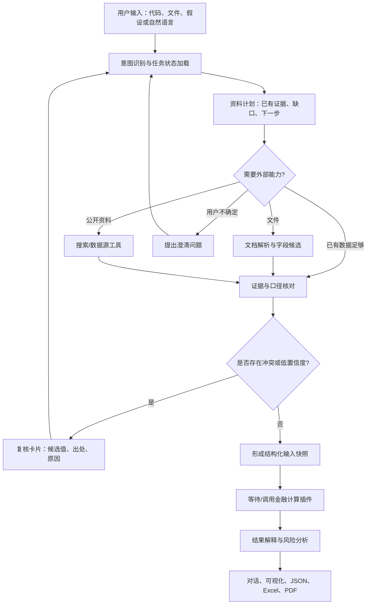

# ValuationAgent 后续实施计划

## ——以 LLM 为核心思考引擎，先完成智能体应用层，再接入金融计算

**版本：v0.1**

**制定日期：2026-09-14**
**适用阶段：当前先不接入正式金融计算函数、金融数据插件和外部搜索插件**

## 1. 计划目标

本阶段的目标不是马上把 DCF 公式接得越多越好，而是先把一个可持续扩展的 ValuationAgent 搭好：它能理解用户意图，管理估值任务上下文，读取和解释用户资料，组织后续工具调用，保留证据和过程，并把结构化结果转成自然语言、页面信息和可导出的研究成果。

金融计算模块接入后，Agent 负责“理解、规划、取证、协调、复核和解释”，程序化金融函数负责“计算、约束和复算”。任何金额、比例、估值区间和敏感性结果都必须来自结构化数据或确定性函数，不能由 LLM 凭语言生成。

本阶段完成后，即使金融计算插件尚未接入，也应能用合成数据、用户文件和模拟工具跑通完整的 Agent 工作流，并清楚标记哪些步骤是真实完成、哪些步骤等待金融插件。

## 2. 对当前代码的判断

当前仓库已经有一条适合继续演进的主线：

```text
CLI / Web
   ↓
ValuationRunner
   ↓
LangGraph 工作流：数据输入 → Agent 规划 → 财务审核 → 假设形成
              → 经营预测 → DCF → 相对估值 → 敏感性 → 区间验证 → 输出
   ↓
Pydantic 数据契约 + ToolRegistry 工具白名单
   ↓
SQLite 任务、版本、消息、工具输入输出和执行事件
```

当前可以直接复用的能力：

- `ValuationRunner` 作为 CLI、Web 和未来其他入口的共享应用服务。
- `ValuationRequest`、`FinancialSnapshot`、`EvidenceRef`、`RunEvent`、`ValuationOutput` 等结构化对象。
- `ToolSpec` 和 `ToolRegistry` 的受限工具调用机制，模型不能执行任意函数。
- 任务版本、复核、恢复、暂停、事件流和对话记录。
- `live`、`snapshot`、`demo` 三种运行模式，以及模型会话按任务绑定的方式。
- CLI 和 Web 使用同一套任务状态、结果和事件，不重复实现业务逻辑。

当前仍应视为边界或占位的能力：

- A 股代码到年报、公告和市场数据的稳定取数。
- PDF、扫描 PDF、Excel 的深层表格解析和字段定位。
- 可比公司不足时的联网检索和来源筛选。
- 多轮上下文中的指代消解、任务切换和长期记忆。
- PDF、Excel 研究报告的正式生成与导出后复核。
- 正式的 DCF、相对估值、收入增长、治理因子和政策影响函数。

因此下一步应围绕 LLM 应用层补齐，而不是先把参考金融模型包装成“正式模型”。参考模型只用于联调接口、事件和页面，结果必须继续标为参考或演示。

## 3. 总体定位：LLM 是思考引擎，不是数字权威

### 3.1 LLM 负责的事情

1. **理解用户意图**：判断用户是在创建估值、补充资料、询问假设、修改参数、要求比较、分析政策、解释结果，还是请求导出。
2. **理解上下文**：知道当前公司、估值日、数据版本、假设版本、已经完成的步骤和用户刚刚修改的内容。
3. **规划工作流**：判断下一步需要读取文件、搜索来源、请求复核、检查可比公司，或等待金融函数。
4. **处理非结构化材料**：从年报、公告、管理层讨论、行业资料和用户说明中找出候选事实、期间、单位、口径和出处。
5. **组织证据**：把每个候选数值或判断关联到文件页码、Excel 单元格、网页来源、发布日期和原文片段。
6. **发现资料不足和歧义**：例如把“净利润”区分成合并净利润和归母净利润，把“现金”区分成货币资金和现金及现金等价物。
7. **提出候选假设**：依据历史数据、行业材料、用户约束和已批准政策给出候选值及理由，等待规则或用户确认。
8. **综合解释**：根据结构化结果说明估值驱动、区间差异、敏感性、风险和限制。
9. **理解政策和治理材料**：提取政策适用范围、生效时间和可能影响，先形成证据卡片，不直接把政策文字变成数值调整。
10. **组织输出**：把同一份结构化结果交给 Web、CLI、JSON、Excel 和 PDF 适配器。

### 3.2 LLM 不负责的事情

- 不直接计算 DCF、倍数、现金流、WACC 或每股价值。
- 不把搜索摘要或模型记忆当成已核验的财务事实。
- 不在缺资料时静默编造历史数据或可比公司数据。
- 不绕过勾稽规则、适用性规则和人工复核。
- 不自行决定是否把治理或政策风险重复计入现金流、WACC 和估值倍数。
- 不直接读取 API 密钥、写入共享环境变量或修改前端状态。
- 不把内部思考链展示给用户；只展示可审计的计划摘要、工具事件、证据和结论。

## 4. 目标 Agent 流水线



每一步都要遵循 **计划 → 调用 → 观察 → 校验 → 决策 → 记录** 的循环。Agent 可以决定调用什么，但工具白名单、参数模型、超时、缓存和结果状态由程序控制。

## 5. 数据来源和“预测数据从哪里来”的统一规则

### 5.1 历史数据的优先级

历史数据按以下顺序处理：

1. 用户上传并确认的文件或手工结构化数据。
2. 用户指定的公开来源或已配置的 A 股数据适配器。
3. 经授权并保存原始响应的官方公告、交易所、公司披露或数据服务。
4. 仅用于定位原文的搜索结果摘要。

搜索摘要只能帮助找到来源，不能直接作为最终事实。关键财务字段至少要保存来源、发布日期、期间、单位、合并口径和原文位置；无法确认时进入复核。

### 5.2 预测数据的来源

预测数据不是只能由用户提供，也不是默认交给 LLM 猜测。统一拆成四种状态：

| 状态 | 含义 | 处理方式 |
|---|---|---|
| `user_input` | 用户明确给定 | 保存原值、单位和来源，优先使用 |
| `observed_market` | 从市场或官方资料观察到 | 保存日期、期限、来源和口径 |
| `calculated` | 由历史数据或确定性规则计算 | 保存公式、输入字段和版本 |
| `model_estimated` | Agent 根据证据提出候选 | 必须说明依据、范围和不确定性，等待政策/用户确认 |
| `policy_default` | 项目批准的默认政策 | 保存政策版本和适用条件，不能伪装成公司事实 |

推荐的决策顺序是：**用户指定 → 已批准的确定性计算 → 有证据的模型候选 → 适用的版本化默认值 → 请求补充**。所有自动填充都要在界面和报告中明确显示来源。

### 5.3 可比公司不足时的联网策略

后续接入 `SearchProvider` 后，Agent 可以在以下条件满足时自动搜索：

- 用户选择了需要可比公司的方法；
- 当前有效可比公司数量低于金融政策规定的下限；
- 现有可比公司缺少所需倍数或期间口径；
- 用户明确要求扩充或重新筛选同业。

搜索工具必须接收结构化参数：公司行业、主营业务关键词、A 股范围、估值日、信息截止日、候选数量、允许域名和查询预算。每个候选公司都要保存纳入/剔除理由、业务可比性、规模、增长、盈利、风险、数据日期和来源。搜索失败时显示失败原因，不能回退为虚构同业。

## 6. 先建设的五类 Agent 能力

### 6.1 意图识别与任务上下文

建立 `IntentInterpreter`，输出稳定枚举和槽位：

```text
new_valuation       创建估值任务
provide_material     提供文件、代码或补充数据
ask_explanation      询问结果、假设、风险或敏感性
revise_assumption    修改假设并创建新版本
compare_versions     比较不同版本或情景
policy_analysis      分析政策/监管材料及潜在影响
request_export       请求 PDF、Excel、JSON 或复算包
resume_review        回复复核问题并继续任务
```

上下文分为五层并设置优先级：系统规则、当前任务、已确认事实、工具观察、对话历史。每轮对话不把全部原文重新塞给模型，而是使用任务摘要、证据索引、最近消息和相关片段。任务版本变化时，自动生成新的上下文摘要，保留旧版本只读。

### 6.2 非结构化文件理解

建立可替换的 `DocumentExtractor` 流程：

1. 文件安全检查：类型、大小、哈希、病毒/宏策略和角色。
2. 文档分类：年报、公告、财务表、假设表、行业资料、政策文件或其他。
3. 文本和表格解析：保留页码、表名、行列标题、Excel sheet/cell。
4. 单位和期间识别：元/万元/亿元、年度/季度、累计/单期、合并/母公司。
5. 字段映射：把原文行名映射为稳定 `metric_id`，同时保留原始标签。
6. LLM 候选抽取：输出值、字段、期间、单位、置信度、证据位置和疑问。
7. 程序化标准化：完成单位换算、日期解析和 schema 校验。
8. 低置信度复核：让用户在原文位置和候选值之间选择，不直接继续正式计算。

扫描 PDF 的 OCR 作为独立适配器，识别结果必须标记为 OCR 来源并允许人工校正。原文中的指令、宏代码或网页提示只能作为数据，不能提升为 Agent 权限。

### 6.3 证据和数据血缘

建立 `EvidenceStore` 和 `EvidenceRef` 扩展字段，至少记录：来源 ID、文件哈希或 URL、发布日期、获取时间、页码/sheet/cell、原文片段、抽取器版本、确认状态和关联字段。

每个结论都应能反向追溯：

```text
自然语言结论
  → 结构化结果字段
  → 假设/事实/计算记录
  → 证据 ID
  → 原始文件或网页位置
```

页面展示“已确认、待复核、仅供参考、缺失”四种状态。置信度用于排序复核，不直接等价于事实真实性概率。

### 6.4 解释、政策和风险分析

建立 `NarrativeGenerator`，只能读取结构化结果、告警、证据和政策卡片。它输出：估值结论、关键驱动、区间形成方法、敏感性、模型限制、数据限制和风险提醒。

政策分析先形成独立的 `PolicyImpactCard`：政策主题、适用对象、生效时间、原文来源、影响渠道、正负面方向、影响期间、证据强度和是否需要金融人员确认。政策卡片默认只进入解释和风险章节；只有金融团队批准了“政策 → 现金流/WACC/倍数”的映射，才允许进入计算输入。

“管理诚信”不直接做人格分数。建议先实现治理与信息质量证据模块，识别审计意见、监管处罚、报表重述、关联交易、资金占用、业绩承诺兑现等可观察事件，再由金融人员决定是否影响回款、损失、情景概率、WACC 或倍数。一个风险不能在多个环节无依据重复计价。

### 6.5 输出和导出编排

建立 `ReportInput` 和 `ArtifactManifest`，先实现 JSON 和 HTML 预览，再接入 Excel/PDF。LLM 只生成文字段落，金额、表格、图表和状态从结构化结果填入。导出前后执行关键数字一致性检查，确保网页、命令行、Excel、PDF 和 JSON 使用同一个结果版本。

## 7. 需要先冻结的接口（暂不接入正式金融函数）

```python
interpret_intent(message, context) -> IntentResult
build_context(task, history, evidence) -> ContextSnapshot
extract_document(document, target_schema) -> ExtractionResult
search_sources(query: SearchQuery) -> SearchResult
resolve_evidence(candidates, policy) -> EvidenceResolution
propose_assumptions(dataset, constraints) -> AssumptionProposal
analyze_policy(document, company_context) -> PolicyImpactCard
generate_narrative(result, evidence, risks, language) -> NarrativeResult
build_artifact(result, narrative, format) -> ArtifactManifest
```

金融函数接口继续使用现有 `FinancialModelPlugin` 契约，但本阶段只做：

- 输入输出 schema 冻结；
- 适用范围和错误码冻结；
- 依赖关系、版本和缓存键冻结；
- 用 mock/stub 验证 Agent 能正确调用和处理状态；
- 不把未审核的参考实现宣传成正式金融模型。

所有 Agent 工具都应具备 `tool_id`、版本、描述、参数 schema、权限级别、是否联网、是否产生副作用、超时、缓存策略和错误码。联网工具与文件工具均通过统一包装层写入真实事件。

## 8. 实施阶段和交付物

### P0：契约和评测基线（1—2 天）

**技术任务**

- 冻结意图枚举、上下文结构、证据结构、工具事件和错误码。
- 画出 Agent 状态机，明确每个节点的输入、输出和阻断条件。
- 建立 `prompts/`、`adapters/`、`evidence/`、`artifacts/` 目录约定。
- 准备一份合成公司资料包和 8 个用户对话样例。

**金融任务**

- 提供字段字典、单位、期间和合并口径定义。
- 提供一个标准案例和一个故意错误案例。
- 明确可比公司最小样本数和“样本不足”的展示语言。

**验收**：技术和金融成员对同一字段、同一来源和同一版本含义一致。

### P1：LLM 网关和结构化调用（3—5 天）

- 完善 OpenAI-compatible 模型适配、超时、重试、限流和错误诊断。
- 支持结构化 JSON 输出、单工具调用、工具参数校验和有限纠错。
- 配置模型能力探测：function calling、JSON、上下文长度、流式输出。
- 记录供应商、模型、提示词版本、请求哈希和响应状态，绝不记录密钥。
- 为 DeepSeek、OpenAI-compatible 和 mock provider 保留一致接口。

**验收**：模型不可用、返回格式错误、工具参数错误和超时均能进入明确的失败或复核状态。

### P2：意图、上下文和多轮对话（3—5 天）

- 实现八类意图和槽位抽取。
- 实现任务摘要、证据索引、版本历史和对话窗口管理。
- 支持“上一版”“刚才上传的文件”“把这个假设改掉”等指代。
- 对新估值、补资料、解释、改假设、比较、政策、导出、恢复复核分别建测试。

**验收**：连续 5—8 轮对话不丢失公司、估值日期、版本和用户意图；修改假设一定创建新版本。

### P3：文件理解和证据链（5—7 天）

- 先支持文本型 PDF、标准 Excel 和 JSON；扫描件 OCR 作为独立后续任务。
- 输出字段候选、单位、期间、口径、原文位置和置信度。
- 增加字段冲突、单位错误、合并/母公司混用、缺少负号等复核场景。
- Web 提供原文位置与候选值对照；CLI 提供可复制的复核摘要。

**验收**：每个候选字段都有证据定位；低置信度和冲突字段不会静默进入正式计算。

### P4：联网搜索和可比公司补全接口（3—5 天）

- 实现 `SearchProvider` mock 和真实适配器接口分离。
- 增加域名白名单、信息截止日、缓存、来源去重和引用保存。
- 当可比公司不足时，让 Agent 说明缺口、自动生成查询、调用搜索、筛选候选并请求确认。
- 搜索不到或来源质量不足时，明确显示原因并保留原任务状态。

**验收**：能展示一次“样本不足 → 搜索 → 候选 → 纳入/剔除理由”的完整事件链；不使用搜索摘要直接伪造倍数。

### P5：自然语言解释、政策卡片和风险报告（3—5 天）

- 让解释 Agent 只读取结构化结果和证据，不自行重算。
- 建立估值摘要、关键驱动、敏感性、风险、数据限制和政策影响模板。
- 支持中文和英文；语言只改变表达，不改变数值和金融假设。

**验收**：解释中的数字与结构化结果逐项一致；每个重要判断有证据或明确标为推断。

### P6：导出和可视化（3—5 天）

- 先生成 JSON 复算包和 HTML 研究预览。
- 预留 Excel 工作簿和 PDF 报告适配器。
- 页面增加 Agent 调用时间线、证据覆盖率、待复核数量、数据血缘、上下文版本和工具失败重试。
- CLI 保持 TradingAgents 风格：欢迎页、阶段面板、Agent/工具面板、结果摘要和统计栏。

**验收**：同一运行的 CLI、Web 和导出文件显示相同的版本、状态和关键数字；事件来自真实执行记录。

### P7：金融插件接入前的冻结验收（2—3 天）

- 用 mock 金融插件验证 Agent 对 `success / needs_review / not_applicable / failed` 的处理。
- 验证模型不可用、搜索失败、文件解析失败、人工复核、任务恢复和版本比较。
- 固定接口、提示词、事件协议、错误码、最小样例和演示脚本。
- 形成金融团队接入清单，之后再逐个接入 DCF、相对估值、收入预测和敏感性函数。

## 9. 对金融小组方案的评估和完善

金融小组的主线是正确的：A 股范围清晰，DCF 与相对估值交叉验证有展示价值，收入增长率是估值的关键难点，财务勾稽和敏感性分析符合方向四的考察重点。

需要补强的地方如下：

| 原方案 | 建议完善 |
|---|---|
| 用户不给预测数据就使用默认数据或进一步计算 | 先区分用户给定、观察值、计算值、模型候选和政策默认，并记录证据、版本和不确定性。 |
| 输入 A 股代码后 Agent 搜索提取 | LLM 负责规划和抽取，实际数据必须来自允许的数据源并保存原始响应；搜索摘要不能直接当事实。 |
| 从年报提取营业利润、净利润等 | 增加单位、期间、合并口径、公告日期、原文位置、归母/合并区分和抽取质量。 |
| 真实上市公司报表通常没有明显错误 | 仍要防止错页、错列、单位误读、累计/单期混淆和母公司/合并串表。勾稽通过不等于经济真实性。 |
| DCF 中预估收入增长率 | 先做历史增长 + 行业基准 + 生命周期的透明基线，再做分部/销量/价格/产能等业务驱动模型，并与再投资、利润率和现金流联动。 |
| DCF 和相对估值取区间互相验证 | 明确每种区间的形成规则、估值对象、日期、样本分位数和不可用条件；重叠区间不代表正确，不重叠也不应强行平均。 |
| 管理诚信作为关键因子 | 改为治理与信息质量证据模块，先识别事件和经济渠道，避免主观打分与重复计价。 |
| 输出 PDF 或 Excel | 增加 JSON 复算包、来源索引、版本、模型/政策版本和导出后数字一致性检查。 |
| 分析政策影响 | 先生成政策证据卡片；只有经金融人员批准的影响映射才进入现金流、WACC 或倍数。 |

建议的金融接入顺序是：

1. 字段字典、单位、期间和证据口径；
2. 财务勾稽和数据质量规则；
3. 透明版 FCFF DCF；
4. P/E、EV/EBITDA 及可比公司筛选规则；
5. 收入增长基线和三情景；
6. WACC × 永续增长率、增长 × 利润率敏感性；
7. 经营驱动收入模型；
8. 治理证据的经济渠道和增量评估；
9. 经验证的 Excel/PDF 导出。

## 10. 冲击高奖应采用的展示主线

推荐用一个“问题被发现、被修正、被解释、可复算”的案例，而不是只展示一个漂亮的估值数字：

```text
用户上传年报/Excel
 → Agent 识别资料角色和公司
 → 提取字段并定位原文
 → 发现单位或合并口径冲突
 → 用户在复核卡片中确认修正
 → Agent 发现可比公司样本不足并检索候选
 → 金融函数形成 DCF / 相对估值和敏感性
 → 用户追问“为什么这个区间变化”
 → Agent 引用证据解释驱动、风险和限制
 → 修改一个假设产生新版本
 → 页面、CLI、Excel、PDF 显示同一份可追溯结果
```

这个展示同时证明四件事：Agent 真正理解和行动；金融计算可复核；异常不会被掩盖；结果可以解释和重算。

## 11. 团队分工

| 角色 | 当前阶段职责 |
|---|---|
| Agent/系统负责人 | LLM 网关、意图、上下文、工具注册、事件、复核、CLI/Web 共用服务、导出编排。 |
| 金融建模成员 | 字段字典、勾稽规则、估值对象、假设政策、可比公司规则、标准案例和 Excel 基准。 |
| 资料与研究成员 | 年报/公告样本、行业资料、政策样本、可比公司理由、证据标注。 |
| 评测成员 | 抽取准确率、冲突识别、引用完整性、上下文测试、失败恢复、复算一致性。 |
| 指导教师 | 模型适用性、风险解释、治理因子经济渠道和参赛材料审核。 |

金融小组每交付一个模型，必须同时提供：字段和单位、适用条件、公式或函数、输入输出 schema、人工核对基准、边界和错误处理。只有 Excel 数字而没有口径和基准，暂时不能接入正式 Agent。

## 12. 当前立即执行清单

### 本周技术任务

- [x] 冻结 `IntentResult`、`ContextSnapshot`、`EvidenceItem`、`SearchQuery`、`PolicyImpactCard`、`ArtifactManifest`。
- [ ] 将工具事件扩展为计划、开始、完成、失败、复核和产物六类状态。
- [ ] 完善 LLM 供应商错误诊断、结构化输出和工具调用能力探测。
- [ ] 建立 8 类意图和 5—8 轮上下文测试集。
- [x] 建立搜索 mock 和未配置 provider；文档抽取 mock、金融插件 mock 继续补齐，并明确它们只用于框架验收。
- [ ] 在 Web 和 CLI 展示证据状态、工具状态、上下文版本和待复核数量。
- [ ] 建立 JSON 复算包和 HTML 预览的统一结果入口。

### 本周金融任务

- [ ] 冻结第一版支持行业、A 股口径、估值日和币种范围。
- [ ] 冻结 `metric_id` 字段字典及单位/期间/合并口径。
- [ ] 提供正常案例、单位错误案例、合并口径冲突案例各一份。
- [ ] 明确 DCF 与相对估值区间的定义、样本下限和不可用条件。
- [ ] 提供收入增长基线所需历史字段和行业基准来源。
- [ ] 把治理诚信改写为可观察证据清单，不先设主观分数。

## 13. 完成标准

本阶段完成的判断标准不是“代码目录里有很多 Agent”，而是：

1. 用户用自然语言提出不同任务，Agent 能识别意图并加载正确上下文。
2. 用户提供文件时，系统能返回候选字段、单位、期间和证据位置；低置信度会复核。
3. 资料缺口、可比公司不足和搜索失败都能被说明，不能静默补假数据。
4. 每次工具调用都有真实事件、参数摘要、结果摘要、耗时和错误状态。
5. 解释文字中的数字全部来自结构化结果，来源和限制可追溯。
6. CLI、Web、JSON 和未来 PDF/Excel 使用同一任务版本和结果对象。
7. 金融插件尚未接入时，系统能明确显示“等待金融模型”，不会伪装成正式估值。
8. 接入金融函数后，只需实现既定契约，不需要重写 Agent、页面和存储层。

最终的优先级应保持为：**财务数据和证据可追溯 > 金融计算可复算 > 假设可编辑和联动重算 > Agent 自主检索与解释 > 高级增长/治理研究 > 增加 Agent 数量**。这条顺序更符合方向四的评分逻辑，也能让项目在金融团队模型尚未全部完成时持续推进。
