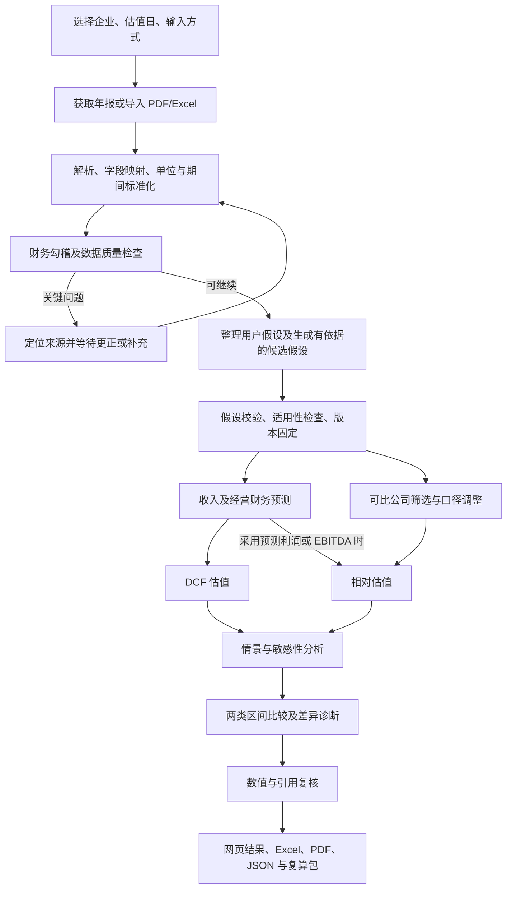
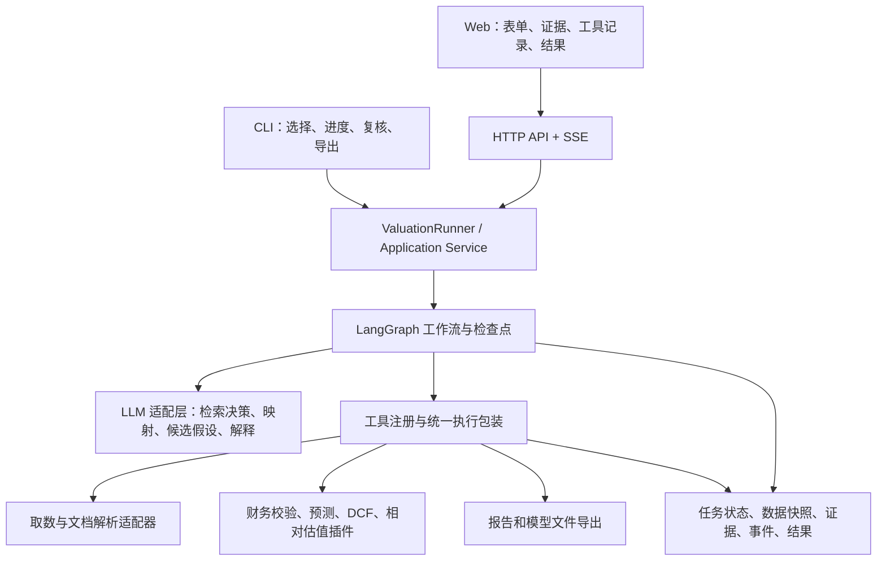

# ValuationAgent 架构与实施计划

版本：v0.1；调研日期：2026-09-12。本文是供技术负责人和金融团队对齐的设计方案，代码示例、目录、接口及命令均为拟定规范，尚未实现。

**1. 项目定位：建立一个能完成估值任务、能说明依据、能接受复核的智能体。**

建议项目名称为“ValuationAgent：可追溯、可复算的自动化估值建模智能体”。用户提供公司代码或财务材料，系统组织数据获取、提取和核验，形成可修改的经营假设，调用金融模型计算价值，再交付估值区间、敏感性分析、Excel 模型和 PDF 报告。

DCF 回答“这家公司未来能创造的现金流，折算到今天值多少”；相对估值回答“与它在业务、增长、盈利和风险方面可比较的企业，目前如何定价”。二者提供不同视角，区间体现假设及样本差异。系统不应把估值区间表述成必然实现的未来股价。

你负责的工作是搭建让数据、假设、模型和证据有序流转的运行框架；金融人员负责字段口径、模型公式、参数政策和标准答案。接口需要现在共同确定，金融公式可以分阶段接入。

**2. 参赛要求与方案依据：明确区分官方要求和团队设计选择。**

微信原链接访问时显示环境验证，未能直接取得正文；已核对中央财经大学教务处正式通知。通知要求使用至少一个大语言模型，输出结构化成果，记录文件访问和工具调用等过程，提供可复现的源码及运行材料；方向四重点考察估值结构、假设、勾稽、合理性和敏感性。这里提出的技术栈、验收指标和优先级均为本项目建议，并非官方评分权重。[中央财经大学正式通知](https://jwc.cufe.edu.cn/info/1101/8132.htm)

已公布报名时间为 2026-09-10 至 10-11，初赛提交截止为 10-18；初赛材料为 PDF 计划书及不超过 5 分钟、500 MB 的 MP4 视频。预计 11 月中旬公布入围，决赛拟于 11 月底举行，需可运行原型、报告、源码、说明及现场样例。后续变更以组委会通知为准。[北京师范大学赛事通知](https://bs.bnu.edu.cn/bkjx/xwtz/69aa6a07be8741958ca89d42e5f4c93e.html)

对应到产品，需要从第一天建设四项能力：数值可追溯、模型可复算、异常可定位、操作可记录。双入口有展示和复现价值；复杂多 Agent 编排并不是获奖的充分条件。

**3. TradingAgents 的参考方式：保留有用交互，重建估值领域流程。**

正确参考项目是用户的 TradingAgents fork；ValuationAnalyst 是用户为新项目创建的仓库。调研源码固定在提交 `be952b8eccb49720509af544c6675233bc1f10d0`，便于后续核对。

源码提供 Typer、Questionary 和 Rich 构成的交互式终端，支持逐项选择参数、查看进度与工具消息。图编排使用 LangGraph，并有 LLM 供应商适配及检查点模块。仓库当前没有完整 Web 前端，报告模块主要生成 Markdown；Web、财务证据视图及 PDF/Excel 模型导出需要新增。[参考 README](https://github.com/boyiwei007-afk/TradingAgents/blob/be952b8eccb49720509af544c6675233bc1f10d0/README.md)、[CLI 源码](https://github.com/boyiwei007-afk/TradingAgents/blob/be952b8eccb49720509af544c6675233bc1f10d0/cli/main.py)、[报告模块](https://github.com/boyiwei007-afk/TradingAgents/blob/be952b8eccb49720509af544c6675233bc1f10d0/tradingagents/reporting.py)

| TradingAgents 中的设计 | ValuationAgent 的对应设计 |
|---|---|
| 股票、日期、分析师、研究深度、LLM 等逐项选择 | 企业、估值日、数据来源、假设来源、模型组合、分析范围、LLM 配置 |
| 左侧阶段进度，右侧消息与工具，下方报告 | 左侧估值步骤，右侧真实工具记录，下方当前财务表/估值结果 |
| 分析师选择 | 选择估值方法及可选增强模块；基础数据校验始终执行 |
| 研究深度影响辩论轮数 | 改为基础/完整分析范围，明确对应情景、敏感性网格、资料范围和调用预算 |
| 快速模型和深度模型 | 首版允许单模型运行；预留提取模型与分析模型分别配置 |
| 多空研究、交易员、风险偏好辩论 | 改为证据核对、经营假设、确定性估值、差异诊断及复核 |
| 交易判断和 Markdown 报告 | 改为企业/股权/每股价值、两套区间、敏感性、Excel/PDF/JSON |
| 工具调用消息流 | 扩充成稳定事件协议，包含来源位置、结果引用、异常及真实耗时 |

不要将交易提示词中的角色名称替换后直接使用。估值需要明确财务字段、公式、计算对象和证据关系，数值正确性应由领域模型保障。

实现时建立共享 `ValuationRunner`。CLI 和 Web 不分别复制参考项目的执行逻辑。参考项目中自动提示并写入 `.env` 的密钥处理方式，不直接用于 Web 会话；财务字段的结构化解析失败，也不能回退为自由文本并继续计算。

已检查仓库的运行截图：黑色背景、等宽字体，顶部绿色标题，上部左侧青色进度面板、右侧紫色工具消息面板，下部全宽报告与底部统计。CLI 可延续这种视觉语言；Web 延续相同信息顺序，增加可展开证据和可编辑假设表。颜色仅辅助状态，所有状态同时保留文字。[参考运行截图](https://github.com/boyiwei007-afk/TradingAgents/blob/be952b8eccb49720509af544c6675233bc1f10d0/assets/cli/cli_news.png)

如实际复制第三方代码，保留对应授权及署名材料，登记来源、提交和修改范围。当前仓库标识为 Apache-2.0；最终以采用的具体文件及 LICENSE 为准。[参考项目 LICENSE](https://github.com/boyiwei007-afk/TradingAgents/blob/be952b8eccb49720509af544c6675233bc1f10d0/LICENSE)

**4. 第一版范围：先做透一个能独立验收的金融场景。**

建议第一版支持 A 股非金融企业、人民币、合并报表、3—5 年历史数据、5 年显性预测期、FCFF DCF 与 P/E、EV/EBITDA 相对估值。选择一个熟悉行业，先做 3—5 家公司的完整案例；覆盖范围是工程建议，须由金融团队按数据可得性确定。

银行、保险、券商先明确提示普通企业 FCFF 模型不适用，保留专用模型接口。金融企业的债务、资本投入和现金流有特殊含义，后续另接 FCFE、股利折现或剩余收益模型。[Damodaran：金融企业估值特点](https://pages.stern.nyu.edu/~adamodar/New_Home_Page/littlebook/financialsvccompanies.htm)

预测模型可先采用 DCF 所需的经营预测表及资本投入附表，并如实说明覆盖范围。冲击高奖时补齐现金、债务、股东权益的滚动关系，交付可勾稽的预测三表；不能把几个收入和现金流字段宣称为完整三表模型。

估值基准日、信息可用截止日、报表期末和市场数据日期必须分开。任意日估值还涉及剩余预测期和折现时间；第一版若只实现年末估值，则在输入界面限定并明确显示，不能把年末折现公式无记录地用于所有日期。

**5. 完整业务流程：保留教授的主线，补上数据标准化、假设管理和模型适用性检查。**



| 阶段 | 核心输出 | Agent 的工作 | 程序和金融工具的工作 |
|---|---|---|---|
| 输入与取数 | 请求、企业身份、原始资料 | 在允许的数据源中决定检索路径 | 身份匹配、下载、文件校验、缓存 |
| 提取与标准化 | 标准财务数据及位置引用 | 解释复杂表格、提出字段映射 | 表格解析、单位转换、期间和口径检查 |
| 数据审核 | 规则结果、待补资料 | 搜索差异证据、提出解决建议 | 计算勾稽差额、判断硬错误 |
| 假设形成 | 分年参数、依据、适用性 | 综合历史与经营证据提出候选 | 合并覆盖规则、参数约束、版本管理 |
| 财务预测 | 收入、利润、再投资和现金流 | 选择适用的注册预测方法 | 执行经过验证的预测函数 |
| 估值与敏感性 | 两种估值和敏感性表 | 解释关键驱动与方法分歧 | DCF、倍数、情景和网格重算 |
| 复核与报告 | 数字一致的多格式成果 | 组织结论、依据、风险文字 | 检查数字与引用，生成和核验导出 |

Agent 的有效自主性示例：发现折旧摊销缺失后，查找现金流附注并提取候选；两个年份列存在歧义时返回复核；发现 P/E 不适用时报告原因，并在已选方法范围内使用适用模型。它必须真正参与检索、映射或假设决策，不能只在流水线末端写几段总结。

**6. 输入设计：四种组合共用一个数据入口和规范。**

| 财务资料来源 | 假设由系统形成 | 假设由用户指定 |
|---|---|---|
| A 股代码 | 获取公开数据，计算或建议假设 | 获取公开数据，读取用户假设文件并补齐未指定项 |
| PDF/Excel | 提取上传数据，计算或建议假设 | 分别解析财务和假设文件，检查期间、公司和单位是否匹配 |

两类上传区独立呈现，避免误将预算当历史事实。文件角色应标注为“历史财务”“经营预算/假设”“可比公司”“其他证据”。同一文件包含多类内容时，解析后分别归类供复核。

基础必填：企业身份或项目名称、估值基准日、数据模式、文件/代码、模型选择。高级项：历史范围、预测年数、行业模板、折现时点、可比公司筛选政策及分析范围。首版只开放已实现、可验收的选项。

建议提供标准 Excel 模板：`Company`、`HistoricalFinancials`、`Assumptions`、`Peers`、`FieldGuide`。同时保留通用 Excel/PDF 解析接口。第一阶段优先模板 Excel 和文本型 PDF；扫描件通过可替换 OCR 适配器接入，识别不可靠时转人工确认。

股票代码路径：企业身份识别 → 允许的数据源 → 原始公告/结构化响应保存 → 时间与口径筛选 → 标准化。巨潮资讯、交易所、公司披露及取得使用权限的数据接口可作为候选；接入哪一家，应通过样例覆盖和授权条件核验后确定。不能预先承诺任意网页都可稳定抓取。行情数据接口与 LLM 接口的凭证分开管理。

封闭环境使用预置数据包或用户上传材料；半封闭环境将外部取数限制在配置的数据源，并保留原始响应、获取时间和文件哈希。数据源失败应显示失败原因和可用替代输入，不能换成 LLM 猜测。

**7. 数据和假设契约：这是你与金融团队最需要先冻结的部分。**

所有事实字段至少包含以下信息；模型自行声明必需字段，不能要求每个任务无差别填满整个字典。

```text
FinancialFact
  fact_id, metric_id, raw_value, normalized_value
  currency, raw_unit, normalized_unit, scale
  period_start, period_end, period_type
  consolidation_scope, accounting_basis
  publication_date, information_cutoff, source_id
  source_location: PDF 页码/表格位置 或 Excel 工作表/单元格
  status: reported / extracted / calculated / missing / not_applicable
  extraction_quality, adjustment_ids
```

`0`、`missing` 和 `not_applicable` 必须区别对待；归母净利润、合并净利润也必须是不同字段。保存原始金额和标准化金额，所有转换有记录。提取质量只表达解析证据或核验状态；未经校准的模型自评分不能当成数据真实性概率。

| 数据组 | 建议最小字段范围 |
|---|---|
| 企业与日期 | 代码、交易所、公司名、行业、币种、估值日、信息截止日、报表口径 |
| 利润 | 营收、营业成本、期间费用、营业利润、利息费用、利润总额、所得税、合并净利润、归母净利润、少数股东损益、非经营/非经常调整 |
| 资产负债 | 总资产、总负债、总权益、现金及受限资金、有息债务、租赁负债、少数股东权益、经营性应收/存货/预付/应付/合同负债、固定及无形资产 |
| 现金流及附注 | 经营/投资/筹资现金净流量、汇率影响、现金等价物期初期末余额、折旧摊销、资本支出、并购和处置调整 |
| 市场与同业 | 股价、市值、普通股股数、债务、现金、净利润、EBITDA、倍数期间口径、纳入或剔除理由 |
| 预测假设 | 分年收入增长、利润率、税、资本支出、折旧、营运资本规则、资本成本及终值假设 |

报表行号和标题不是稳定接口，先统一 `metric_id` 与字段定义，再为来源建立映射；企业可以按重要性调整报表项目展示。[财政部：合并财务报表格式](https://www.mof.gov.cn/zcsjtsgb/gfxwj/201909/t20190919_3583704.htm)

```text
Assumption
  assumption_id, parameter, value_or_year_series, unit
  scenario, applicable_period, source_type
  evidence_ids, method_id, rationale, uncertainty_range
  status: proposed / accepted / rejected
  version, supersedes, change_reason
```

假设来源枚举：`user_input / observed_market / calculated / model_estimated / policy_default`。来源可区分“给定”“计算”“估计”，不能全部归为默认值。

优先级建议：合法的用户指定 → 已批准方法计算 → 有依据的行业/模型估计 → 适用且有版本的默认政策 → 无法可靠补齐则请求补充。该优先级不允许覆盖历史事实：用户提供的模拟历史数据应形成独立数据集；与公开报表冲突时显示差异。

无风险利率可采用与估值币种和期限适配的国债收益率政策，记录日期、期限、曲线和数值；“10 年期”不是“10%”。Beta、ERP、债务成本和资本结构都需要方法或来源，不能长期使用未经标注的常数。[中债收益率曲线入口](https://yield.chinabond.com.cn/cbweb-cbrc-web/cbrc/showCbrc)

还需冻结：`EvidenceRef`、`FinancialDataset`、`ValidationReport`、`ForecastResult`、`ValuationResult`、`SensitivityResult`、`ReconciliationReport`、`RunManifest`。其中结果必须标明估值对象、日期、币种、单位、区间形成方法、模型版本、输入哈希和限制。

**8. 金融计算的边界：先预留清晰接口，再接入经过验证的公式。**

推荐以 FCFF 为第一版 DCF 主模型。简化的盈利企业计算链为：

```text
Revenue_t = Revenue_(t-1) × (1 + Growth_t)
EBIT_t = Revenue_t × EBIT_margin_t
NOPAT_t = EBIT_t − Operating_cash_tax_t
FCFF_t = NOPAT_t + D&A_t − Capex_t − ΔOperating_NWC_t

在固定 WACC 且期末折现的约定下：
Operating_value = Σ[FCFF_t / (1 + WACC)^τ_t]
                  + Terminal_value / (1 + WACC)^τ_N
Terminal_value = Normalized_FCFF_(N+1) / (Terminal_WACC − g)

Common_equity_value = Operating_value + 非经营资产价值
                      − 有息债务 − 少数股东等非普通股权利价值
Per_share_value = Common_equity_value / 对应普通股股数
```

`τ_t` 是从估值基准日到相应现金流时点的期限。通常盈利情形可采用 `EBIT × (1−税率)` 计算 NOPAT；亏损、税亏结转和现金税另设政策。企业经营价值到普通股价值的每一项调整应有明细，避免重复计算现金、债务或少数股东权益。[Damodaran：FCFF 模型](https://pages.stern.nyu.edu/~adamodar/pdfiles/eqnotes/fcff.pdf)

终值不是把最后一年现金流机械增长一次：需使长期增长、利润率、再投资与资本回报一致，并满足 `g < Terminal_WACC`。终值占比应展示，过度依赖终值时给出解释及压力情景。[Damodaran：终值与超额收益](https://pages.stern.nyu.edu/~adamodar/New_Home_Page/valquestions/termvalueexreturns.htm)

金融团队必须确认的具体口径包括：营业利润如何调整为经营 EBIT；资本支出与折旧如何提取；经营性净营运资本包含哪些科目；现金与受限资金如何分类；租赁与少数股东权益如何处理；资本成本采用哪些权重和日期。

相对估值先支持两类：P/E 匹配普通股权益口径利润；EV/EBITDA 匹配经营企业价值及一致的 EBITDA 口径。同业筛选不能只有行业标签，还应记录业务、增长、盈利、规模和风险的可比性。历史 FY、LTM 与预测 NTM 分开，目标公司与同业采用同一规则。负利润或非正 EBITDA 时，相应倍数返回不适用。[Damodaran：估值倍数的定义与比较](https://pages.stern.nyu.edu/adamodar/New_Home_Page/lectures/multintr.htm)

**9. 数据审核：上市公司真实报表同样必须经过检查。**

审查要区分报表算术关系、数据口径和经营异常。上市公司资料可能在提取中出现错列、错页、单位混用或合并/母公司串表；勾稽通过只说明内部一致，不能证明经济真实性。

| 类型 | 示例 | 处理 |
|---|---|---|
| 硬错误 | 资产不等于负债加权益；所得税桥接错误；关键字段缺失 | 阻断依赖该数据的正式计算，定位原始位置 |
| 口径冲突 | 万元/亿元混用；归母和合并混用；年度与累计季度混用 | 标准化或提交复核，保存调整记录 |
| 来源冲突 | 不同版本年报数据不一致，或用户文件与公开数据不一致 | 保留候选和发布日期，按明确政策选用 |
| 软异常 | 应收快于营收增长；利润与现金流背离；利润率跃升 | 可继续，但进入假设和风险说明 |
| 模型非法 | 永续增长率不小于终值 WACC；不支持行业 | 返回非法参数或不适用，不强行给数字 |

核心规则至少包括：资产负债平衡；利润总额减所得税等于净利润；合并净利润等于归母净利润加少数股东损益；三类现金流加汇率等影响等于现金净增加额；现金期初加净变动等于期末。容差依披露精度和规模设置，并保存实际差额与阈值。

不能直接要求资产负债表“货币资金”等于现金流量表“现金及现金等价物”，需要考虑受限资金等调节；不能将全部投资现金净流出当资本支出；不能把财务费用总额直接当利息费用。

复核记录保存 `rule_id / severity / actual / expected / difference / tolerance / evidence_ids / action`。允许用户修正提取结果和确认合理解释，但不允许把数值不平衡的模型标成通过。信息不足时可导出诊断报告，明确估值部分未完成。

**10. 区间与敏感性：在第一版就完整设计输出结构。**

至少安排四类分析：

- 悲观、基准、乐观经营情景，各自有一组相互一致的经营假设。
- WACC × 永续增长率二维表，非法组合标记为不适用。
- 收入增长 × 营业利润率二维表，联动重算税、营运资本和再投资。
- 关键参数单变量影响排序，用于解释主要价值驱动。

收入提高会同时影响利润、营运资本和资本开支，不能只改最终 FCFF。相对估值还需展示同业纳入/剔除、倍数分位数及样本不足影响。小样本分位数只能描述所选样本，不能包装成统计置信区间。

所有区间应注明来源，例如“经营情景区间”“同业倍数分位区间”“参数扫描区间”。除非有明确概率模型和校准，不使用“95% 置信区间”等表述。

第一版交叉验证采用“分别展示 + 一致程度 + 分歧诊断”。例如仅用于说明机制的虚构结果：DCF 为 80—110 元/股，相对估值为 100—140 元/股，重叠为 100—110 元/股。重叠是描述结果，不能据此认定更可靠的最终区间。

无重叠时检查日期、EV/股权口径、利润调整、预测期、同业、增长和折现率，允许结论为“存在分歧，需复核”。后续金融团队通过 `ReconciliationPolicy` 决定是否指定主模型或采用有依据的权重。没有认可政策时，结果的 `combined_range` 可以为空。

**11. 收入增长与治理因素：把研究亮点做成可比较、可解释的模块。**

收入预测按三个阶段建设：

| 阶段 | 方法 | 验收方式 |
|---|---|---|
| 透明基线 | 历史增长/CAGR、行业基准、逐步向长期增速收敛 | 与人工计算一致，异常基期可识别 |
| 业务驱动 | 分部收入；销量×单价；产能×利用率×单价；客户数×ARPU | 每项驱动有资料，收入变化能解释 |
| 研究增强 | 订单、行业、产能和经营文本辅助参数；数据足够再评估统计/机器学习预测 | 按时间切分，与基线对比误差、偏差和稳定性 |

LLM 提出带证据的假设或驱动解释，计算函数生成预测序列。不要将 `ROIC × 再投资率` 直接当营业收入增长；它主要联系经营利润增长与资本投入。收入、利润率和再投资应共同约束。[Damodaran：增长的基本决定因素](https://pages.stern.nyu.edu/~adamodar/New_Home_Page/valquestions/growth.htm)

“管理诚信”建议改称“治理与信息质量证据模块”，先处理可观察材料：审计意见、正式监管处罚、报表重述、关联交易、资金占用、业绩承诺兑现等。模块保存事件、日期、来源、相关字段和可能经济影响，避免用无法验证的人格评分替代证据。

接入顺序为：证据识别与风险标签 → 金融人员确认经济渠道 → 对坏账、回款周期、现金损失或经营情景的明确调整 → 比较启用与未启用结果。同一风险不能同时无依据地减少现金流、抬高 WACC、压低倍数而重复计价。第一版预留接口并展示证据即可。

**12. 工程架构：一个共享核心，两个入口，多种可替换适配器。**



建议首版栈：Python 核心；LangGraph 显式工作流；Pydantic 数据契约；FastAPI 服务；Typer、Questionary、Rich 命令行；React、TypeScript 网页；SQLite 与本地文件保存任务和产物。前端只显示后端结果及用户修改，不再另写财务公式。

LangGraph 提供状态、持久化、流式输出及人工介入机制，适合包含复核和恢复的流程；业务逻辑仍保留在普通 Python 函数中。[LangGraph 官方文档](https://docs.langchain.com/oss/python/langgraph/overview)

类型边界使用严格校验，在解析层明确完成百分数、日期及单位转换，避免把 `10`、`0.1`、`10%` 静默视作同一值。[Pydantic 严格模式](https://docs.pydantic.dev/latest/concepts/strict_mode/)

Web 进度采用 SSE，将事件 ID 用作断线续接游标。断线续接依赖服务端持久化事件与客户端去重，不是接上 SSE 就自动获得完整回放。[FastAPI SSE 文档](https://fastapi.tiangolo.com/tutorial/server-sent-events/)

首版一个主控工作流足够，可将资料整理、假设分析、复核实现为不同提示词节点。后期只有在独立复核确有评测收益时再拆 Reviewer Agent。先不引入复杂消息队列、集群或向量库；文档原文和事实字段可用文件索引及结构化检索解决。

MCP 可以作为后续对外工具适配层，不应成为内部金融函数依赖。真正使用的 Prompt、规则、工具和相关配置需要随源码交付；无需为形式额外搭建空的协议层。

建议目录：

```text
ValuationAgent/
  pyproject.toml
  .env.example
  src/valuationagent/
    schemas/             # 请求、财务事实、假设、结果、事件
    application/         # Runner、运行配置、任务操作
    workflow/            # 图、节点、路由、复核和检查点
    llm/                 # 供应商、结构化响应、能力检查
    tools/               # 工具注册、执行包装、权限与调用日志
    data/                # 公告与数据源、PDF/Excel、标准化
    finance/
      contracts/         # 金融插件规范
      validation/        # 勾稽与适用性规则
      forecasting/       # 收入和经营预测
      dcf/               # DCF、资本成本、价值桥接
      relative/          # 同业与倍数
      sensitivity/
      reconciliation/
      governance/
    reporting/           # 统一报告对象、PDF/Excel/JSON
    storage/             # SQLite、文件、证据与事件
    cli/
    api/
  web/                   # React 页面
  configs/               # 数据字典、假设政策、模型和行业配置
  prompts/               # 版本化提示词
  examples/              # 标准模板、合成样例、允许分发的数据包
  tests/                 # 模型、工具契约和关键任务验收
  docs/                  # 架构、金融规范、运行、来源与许可
  runs/                  # 本地运行产物；默认不提交原始用户资料
```

**13. 金融和工具接口：插件替换不应要求重写前端。**

```python
# 拟定函数契约；数据类型由 schemas/ 定义。
fetch_company_data(request, context) -> RawDataBundle
extract_financials(documents, schema, context) -> ExtractionResult
normalize_financials(extraction, policy) -> FinancialDataset
validate_financials(dataset, ruleset) -> ValidationReport
resolve_assumptions(dataset, overrides, policy) -> AssumptionSet

forecast_revenue(inputs: RevenueForecastInput) -> RevenueForecast
forecast_financials(inputs: ForecastInput) -> ForecastResult
calculate_capital_cost(inputs: CapitalCostInput) -> CapitalCostResult
calculate_dcf(inputs: DcfInput) -> DcfResult
select_peers(inputs: PeerSelectionInput) -> PeerSet
calculate_relative_valuation(inputs: RelativeInput) -> RelativeResult
run_sensitivity(inputs: SensitivityInput) -> SensitivityResult
reconcile_valuations(inputs: ReconcileInput) -> ReconciliationReport
assess_governance(inputs: GovernanceInput) -> GovernanceEvidence

build_report(inputs: ReportInput) -> ArtifactManifest
```

每个插件登记 `plugin_id`、`version`、输入输出 schema、适用范围、必需字段、默认参数政策和是否确定性。金融计算插件是可独立调用的函数，不自行联网、不读取密钥、不操纵页面、不暗改输入。其工具包装层统一负责日志、超时、事件、缓存和错误类型。

结果统一包含 `status`（success / needs_review / not_applicable / failed）、结果数据、计算明细、假设引用、证据引用、告警、版本及输入哈希。未实现插件在能力列表中标记 `available=false`；被调用时返回 `status=failed` 和 `error.code=NOT_IMPLEMENTED`，不得返回看似正常的模拟估值。演示替身只在显式 demo 模式可用。

金融人员每交付一个模型，需要同时提供六件东西：字段定义及单位；适用条件；公式或可执行函数；输入输出样例；经人工核对的 Excel 基准；异常与边界处理。若先交 Excel，也应有具名单元格/工作表输入输出规范和固定版本，禁止执行未经审核的宏。

你负责将插件接入注册表、工作流、事件和页面；教授审核金融政策；双方以同一组标准样例验收。最早要确定的文档是数据字典、假设字典、模型输入输出契约和一份标准案例。

**14. CLI 与 Web：共享请求、事件、复核及结果对象。**

CLI 交互式顺序建议为：选择财务资料来源 → 输入代码或文件 → 确定企业/日期/口径 → 选择假设方式 → 选择模型组合和已支持分析范围 → 确认配置 → 运行。密钥按用户要求从环境变量读取；非敏感的模型配置可通过交互修改。

拟定环境变量：

```text
VALUATION_LLM_PROVIDER
VALUATION_LLM_BASE_URL
VALUATION_LLM_MODEL
VALUATION_LLM_API_KEY
VALUATION_DATA_PROVIDER
VALUATION_DATA_API_KEY
```

拟定命令（尚未实现；公司代码仅演示参数形式）：

```text
valuationagent                          # 交互选择入口
valuationagent run --request case.yaml
valuationagent run --ticker 600519.SH --valuation-date 2026-09-12
valuationagent run --financials annual.xlsx --assumptions assumptions.xlsx
valuationagent inspect <run_id>
valuationagent resume <run_id>
valuationagent export <run_id> --formats pdf,xlsx,json
valuationagent recompute <run_id>        # 固定数据、假设及模型重新计算
valuationagent replay <run_id>           # 明确展示历史回放
```

股票代码使用内部统一身份格式，通过数据源适配器转换。例如某些行情源使用 `.SS`，内部可采用 `.SH`；不能让数据源后缀贯穿整个模型接口。非交互运行遇到关键缺项时返回机器可读错误及非零退出状态，不无限等待输入。

Web 建议四个主要视图：

| 视图 | 组件和操作 |
|---|---|
| 新建估值 | 分组表单、股票/文件切换、财务/假设独立上传、模板下载、模型选择、日期和口径 |
| 运行工作台 | 左侧阶段进度；中央工具时间线和当前表格；右侧依据/异常；底部产物和耗时 |
| 复核与假设 | 原文与字段对照、PDF 页码/Excel 单元格、规则差额、候选值、修改原因、继续运行 |
| 结果与对比 | 两类估值、价值桥接、假设表、预测表、同业表、热力图、风险、版本比较及下载 |

另用设置面板配置供应商、Base URL、模型 ID、API Key、连接测试和调用预算；技术配置不占用普通估值结果页面。API Key 默认仅保留在会话内，由后端调用模型，不写入浏览器持久存储、日志、运行包和报告。不能将不同 Web 用户的 key 写进共享进程环境变量。

首版支持一种实际验证过的供应商和可配置的兼容接口；启动时检查工具调用、结构化输出和流式能力。接口地址兼容不代表所有模型能力完全一致。请求超时、限流和认证错误分别显示。

应用级 API 可先保留：

```text
POST /api/files                       上传并返回文件 ID
GET  /api/capabilities                可用模型、模板、数据源与功能
POST /api/model-connections/test      会话级模型连接测试
POST /api/runs                        创建任务，返回 run_id
GET  /api/runs/{id}                   状态及当前版本
GET  /api/runs/{id}/events            SSE 事件，支持游标续接
GET  /api/runs/{id}/evidence/{eid}     来源位置与原始证据
POST /api/runs/{id}/reviews           提交更正或复核决议
POST /api/runs/{id}/revisions         更新假设并建立新版本
POST /api/runs/{id}/resume            从可恢复状态继续
POST /api/runs/{id}/cancel            取消任务
GET  /api/runs/{id}/results           结构化结果
GET  /api/runs/{id}/artifacts         可下载产物
```

CLI 直接调用共享服务，不依赖用户先启动 Web 服务器；Web 通过 HTTP 使用同一服务。运行中调整假设应创建新版本或排队处理，避免在并发计算中修改共享输入。

**15. 工具可视化、错误与复算：所有显示都来自真实执行事件。**

```json
{
  "run_id": "run_001",
  "revision": 1,
  "sequence": 27,
  "type": "tool.completed",
  "stage": "financial_validation",
  "tool_call_id": "call_08",
  "tool": "validate_financials",
  "status": "needs_review",
  "summary": "资产负债表存在超出披露精度的差额",
  "input_ref": "financials_v1",
  "output_ref": "validation_v1",
  "evidence_ids": ["evidence_12"],
  "duration_ms": 320
}
```

事件还需时间戳、工具及模型版本和重试序号。类型至少有任务/阶段/工具的开始、完成、失败，以及 `review.required`、`review.resolved`、`artifact.created`、`run.cancelled`。相同事件可渲染为 CLI 表格或 Web 卡片。

卡片显示工具名、脱敏参数、调用原因摘要、实际输出摘要、来源、耗时和错误。工具未返回时显示运行中；失败时显示失败。无需展示模型内部思维链，更不能用预录消息或进度动画冒充真实调用。

状态建议：`CREATED → RUNNING → WAITING_REVIEW → RUNNING → COMPLETED`，另有 `FAILED / CANCELLED / COMPLETED_WITH_WARNINGS`。数据无效不能仅标成带告警成功；缺失某方法时应显示每个模型的独立状态。

网络和限流可有限重试；结构化格式错误可有限修复并再次校验；持续失败转复核或终止。财务算术错误和非法假设不通过反复询问 LLM 来消除。所有必经检查由代码路由保证，模型不能自行跳过。

用户修改 WACC，只重算 DCF、相关敏感性、区间比较和报告；修改收入预测，则重新计算经营预测及其所有下游，包括采用预测利润或 EBITDA 的相对估值。历史利润倍数不因预测修改而机械变化。依赖关系及缓存键包含输入哈希、模型版本和政策版本。原始文件保持不变，更正以追加记录形成新 revision。

每次运行保存原文件、标准化事实、来源索引、采用假设、金融输出、事件、代码和提示词版本、模型供应商与模型 ID、运行政策、产物清单及哈希。文件访问通过统一工具入口记录。文档内容按数据处理，不能将其中的指令升级成系统工具权限。

运行模式明确区分：

| 模式 | 含义 | 标识 |
|---|---|---|
| live | 真正调用 LLM 并执行当前任务；资料可来自上传/固定数据包或允许的在线数据源 | 真实运行及实际数据来源 |
| recompute | 复用已固定数据与假设，重新执行确定性金融模型 | 复算，不冒充重新研究 |
| replay | 重放历史事件及既有产物 | 历史回放 |
| demo | 合成资料或未验收模型用于框架调试 | 演示数据/演示模型 |

固定 LLM 温度不能保证每次文本一致；可保证的是冻结输入、假设和版本后的金融复算精度。现场应能处理新样例并真实调用允许的模型；回放只是辅助展示。完全断网时可配置已验证的本地模型，最终环境许可须按组委会要求确定。

**16. 输出：一份规范化结果生成全部页面与文件。**

| 产物 | 内容 |
|---|---|
| Web 结果 | DCF/相对区间、基准情景、日期、单位、来源、关键假设、敏感性与复核状态 |
| PDF | 摘要、方法及适用性、数据说明、假设依据、估值、区间比较、敏感性、风险及引用 |
| Excel | Readme、Historical、Adjustments、Assumptions、Forecast、DCF、Peers、Sensitivity、Checks、Sources |
| JSON | 完整结构化输入摘要、模型结果、区间类型、告警、版本和证据 ID |
| 复算包 | 允许分发的数据快照、假设、配置、版本清单、事件及重算说明，剔除密钥 |

Excel 应有可检查的公式或明确的计算明细，避免只贴最终数值。金融函数与 Excel 公式可来自共同公式定义或通过标准案例逐项对照。导出库写入公式不等于已完成公式求值，应在实际 Excel/兼容计算环境中核对结果及缓存值。PDF 检查分页、表格和图表是否完整。

LLM 负责报告的文字表达，金额和比例通过结果对象填入；报告不能让 LLM 再算一遍。各端用同一个 `ReportInput`，导出后检查关键数值一致和来源引用可用。

**17. 实施顺序：先完成可运行的纵向样例，再扩展输入与研究模块。**

下列工期按小团队持续协作估算，不是交付承诺；优先保住完整闭环和可验收性。金融团队应从第 1 周提供口径及基准，不能等网页全部完成才开始对接。

| 阶段 | 建议时间 | 技术交付 | 金融交付 | 完成标准 |
|---|---|---|---|---|
| P0 对齐 | 9/12—9/14 | 请求/事实/假设/结果/事件 schema，页面草图，插件契约 | 支持行业、字段字典、1 个标准案例 | 双方对同一数据和输出含义无歧义 |
| P1 框架闭环 | 9/15—9/21 | 共享 Runner、真实 LLM 工具调用、CLI、基本 Web、事件与快照 | 简化透明 DCF/倍数参考计算 | 模板数据能贯穿全流程；demo 状态明确 |
| P2 数据与模型 | 9/22—9/28 | 文本 PDF/Excel、一个受控取数适配器、来源定位、复核恢复 | 勾稽规则、假设政策、正式模型首版及基准 | 正常与错误样例均可正确处理 |
| P3 可用成果 | 9/29—10/5 | PDF/Excel、敏感性、版本比较、确定性复算 | 同业规则、收入基线、区间诊断政策 | 两入口与各格式数字一致 |
| P4 比赛打磨 | 10/6—10/12 | 新样例演练、失败恢复、依赖及运行包、评测统计 | 3—5 家案例复核、风险说明 | 可现场展示和独立重现 |
| P5 初赛提交 | 10/13—10/18 | 版本冻结、计划书、5 分钟内介绍视频 | 核对论文式表述和案例结论 | 材料与演示版本对应 |
| 决赛增强 | 入围前后至决赛 | 完整三表联动、收入驱动模型、独立复核和扩展评测 | 治理证据经济渠道及因子增量评估 | 在基线上证明具体改进 |

如果你当前只做“框架完成”，P1 的验收应包括：CLI 与 Web 都能表达四种输入组合；至少一条真实 LLM→工具→结构化输出链路；插件可替换；事件确实来自执行；缺失/失败能复核和恢复；修改假设能产生新版本；所有尚未接入的能力明确标识。并不要求 P1 已完成通用 OCR、全 A 股取数或高级预测。

框架阶段建议有一个使用合成资料的透明参考模型，以便真实走通敏感性和报告接口。它是接口验收工具，后续由金融团队核准或替换；不能将硬编码结果用于正式估值。

**18. 冲击高奖的验证方式：用可检查的能力和对比实验支撑亮点。**

| 能力 | 建议评测 | 判定方式 |
|---|---|---|
| 数据提取 | 金融人员标注的 PDF/Excel 字段、单位、年份和出处 | 字段/数值/位置准确性，关键缺失率 |
| 勾稽核验 | 注入错单位、错列、漏负号、假平衡等样例 | 错误检出、误报和定位是否正确 |
| 金融计算 | 与人工 Excel 基准逐项比对 | 约定精度内一致，价值桥接完整 |
| 假设质量 | 来源覆盖、适用性、可解释性及非法组合 | 每个关键假设可说明来源，无静默补值 |
| 工程可靠性 | 超时、缺 key、断线、进程恢复、插件替换 | 明确失败、可恢复、结果不混用 |
| 增长研究 | 时间切分样本，对比朴素基线 | 预测误差、偏差、稳定性及解释能力 |
| 可复现性 | 固定输入/假设/版本的重复运行 | 数值在声明精度内一致 |
| 展示价值 | 新样例、异常、更正、联动重算、导出 | 评委能看到问题被发现及结果如何变化 |

至少准备这些验收案例：正常非金融公司；万元/亿元混用；不平衡报表；合并与母公司串表；折旧缺失；OCR 丢负号；`g >= WACC`；亏损导致 P/E 不适用；DCF 与倍数结果不重叠；仅修改 WACC 的增量重算；估值日之后资料被排除；工具超时后恢复。

标准案例应覆盖预期成功和预期失败。没有准确说明失败原因而随便输出数字，不算任务完成。数值容差由字段披露精度和金融团队约定，不能只检验“函数能运行”。

建议展示链：上传新样例 → 自动抽取并定位来源 → 发现一个错单位/口径问题 → 人工更正留下记录 → 完成两类估值 → 修改一个经营假设 → 展示联动重算与区间变化 → 下载可复核模型。用这一条链能同时展示 Agent 决策、金融专业性和工程可靠性。

优先级建议为：财务正确及证据完整 > 假设可编辑且联动重算 > 收入驱动研究 > 治理因素扩展 > 增加 Agent 数量。不要以贴近当前股价作为内在价值准确性的证明，也不要在没有对比实验时宣称某个因子或多 Agent 结构提升精度。

**19. 团队分工及近期冻结事项：把金融语义前置。**

| 责任人 | 应负责的成果 |
|---|---|
| 你：Agent/系统负责人 | 共享核心、图编排、LLM/工具适配、事件、双入口、任务存储、恢复和打包 |
| 金融建模成员 | 字段映射、勾稽、现金流/资本成本、倍数口径、标准 Excel、假设政策 |
| 经营研究成员 | 行业资料、可比公司理由、收入驱动、治理证据及情景解释 |
| 数据/评测成员 | 原始资料整理、字段标注、日期检查、失败样例、评测和演示材料 |
| 指导教师 | 模型适用性、关键口径、异常处理与创新论证审核 |

如果团队人数较少可合并角色，但每份数据字典、模型和基准案例都应有明确审核者。现在先冻结：支持的行业和估值时点；`FinancialFact` 与 `Assumption`；金融函数契约；主工作流及必经规则；统一事件；CLI/Web 规范；一个贯穿全链路的标准样例。

后续仍需金融团队决策的内容包括：详细 EBIT/营运资本/资本开支调整、终值稳态、WACC 参数政策、同业筛选阈值、区间合成政策、治理因素量化。框架先允许它们作为版本化政策插入，不用为未确定的方法预设一个貌似确定的答案。
